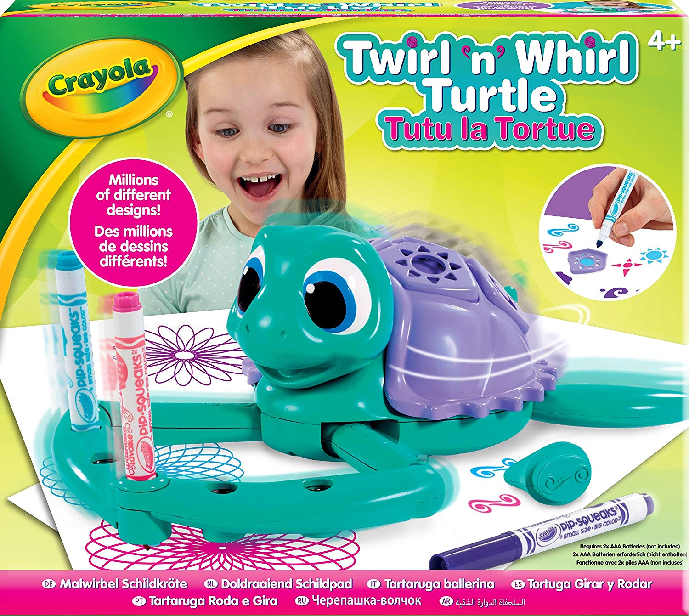

<h1>Turtle commander</h1>
  
A program in Python that models a drawing turtle and takes commands from the user that commands the turtle to move in all directions, to draw, which colour the turtle should use to draw. 

 
<i>An illustration of the toy that this program is based on is shown below</i>

  

 

